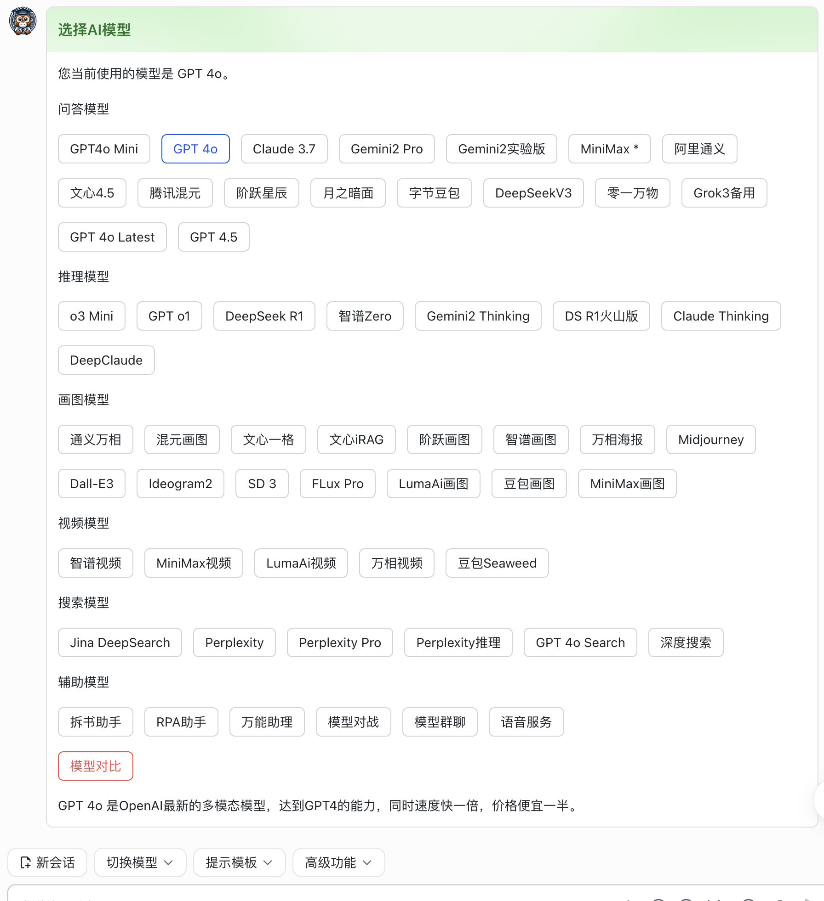

### 为飞书聊天机器人度身定制的AI智能助手后端项目，集成(几乎)所有大模型，在飞书聊天窗口中调用Multi Agent完成复杂任务。同时提供统一模型调用接口。

#### 本项目只是个纯代码分享，不涉及任何账号申请、账号共享等内容，您需要自行解决账号问题。

#### 本项目的开发理念：与AI的对话方式应该尽量自然，而最自然的交互方式，就是聊天工具的聊天窗口。
而在所有的聊天工具里，飞书又是最自然的。因为：
1. 它是唯一一个实现了流式打字效果输出的聊天工具，并且完全开放了API。
2. 自然解决了用户管理和权限问题，如果没有特殊需求，项目不需要自行处理这些问题。
3. 自然解决了聊天记录管理的问题。

因此，本项目几乎是专为飞书而生，部署后新建一个飞书机器人，把机器人的权限开通好，消息通知地址加上，立即可用。

基于前面的自然交互的理由，本项目目前也不支持把机器人加入到群里面去聊天，仅支持一对一私聊。因为在群里不可能理清楚上下文。

在聊天窗口需要放一个开启新会话的按钮，让用户主动截断对话，因为聊天窗口是连续的，程序并不知道什么时候应该截断对话开始新的上下文。

#### 项目亮点（自我感觉）：
1. 几乎支持大模型API支持的所有功能，并第一时间跟进新的API接口与模型支持。对于飞书卡片无法正常显示的mermaid流程图，markmap思维导图，Latex数学公式都进行了解决，虽然不能改变飞书卡片，但用其它办法做了方便的实现。如果模型返回HTML代码，也可以在飞书里直接点击预览网页效果，不需要手工复制代码创建本地HTML文件。
2. 实现了一些简单Agent功能：包括自动按章节拆书总结，自动抓取网页内容进行问答，通过Function call自动查询天气、自动调用搜索引擎进行回答、自动调用画图模型（能够让GPT和Claude自动调用Midjurney或Ideogram并支持连续对话增量画图）、用代码进行数学表达式计算获得精确结果，还能直接把数据返回飞书卡片支持格式直接显示成动态可交互的图表（支持柱状图、折线图、饼图）。如果模型返回了SVG代码，会尝试在服务器端自动转成一张图片并发送到飞书。
3. 还有几个高级Agent功能：比如自动拆解任务并多次调用搜索引擎查询不同的主题，最后汇总结果生成一份报告；在服务器端打开一个虚拟浏览器打开指定的网站进行自动化操作来完成用户的指令；以搜索或收集信息过程中将计划和分步骤结果写入到服务器端的一个markdown文件中，并发送到飞书；以及一个更高层的Agent可以调度其它所有Agent来完成复杂任务。(Agent越复杂，对模型本身的能力依赖越高，需要使用GPT4o或者Claude 3.7。虚拟浏览器功能只有Claude 3.7支持。）
4. 增加新模型和新Agent非常容易，复杂的Function call递归调用系统已经自动处理了，不用去关心。
5. 虽然是为飞书而生，但仍然提供了WebApi接口，可以用来接入到自己的网页、小程序、各种原生App等等任何地方（每种项目我都有实际跑通的示例可证），而且Web端还多两个高级功能，返回文字回答的时候可以同时返回文字转语音，实现实时朗读（利用MiniMax的流式转语音功能，效果非常棒），还有封装了多家websocket接口为统一websocket接口，可以实现诸如实时语音识别成文字、实时双向翻译、OpenAI的realtime实时语音聊天接口等等接口的大一统。
6. 可以很方便的接到很多个飞书机器人的后面，每个机器人负责某一个专一功能，比如专门读书的，专门使用浏览器的，等等。


#### 功能演示：

https://github.com/user-attachments/assets/a29df0b9-abe6-44c1-9058-22b3bfe6cada


https://github.com/user-attachments/assets/e5be25e6-5a42-478b-8e9b-43a18923bd72


https://github.com/user-attachments/assets/de664d6f-b5cf-42ed-979e-e5a394b31596


#### 项目部署方式：
- 一定要有Docker！
- 要有一台能编译和运行Docker镜像的服务器，并且有域名能够被外网正常访问。使用二阶段编译，除了docker不依赖任何编译环境。
- 自己要有各家大模型公司的账号，以及可正常访问其服务器的方式。（走其它聚合API接口也可以，建议直接将Docker部署在海外的服务器上，或者使用nginx自建海外的转发服务器。）
- 有一个已经创建好的飞书机器人，并开通了所需要的权限和订阅了相关的事件。（没有的话可以新创建一个。所需要的权限列表在readme目录下的permissions.json里，可以在机器人的权限管理中直接通过导入方式批量开通。在事件配置里订阅两个事件：im.message.receive_v1，application.bot.menu_v6，在回调配置里订阅一个事件：card.action.trigger。）

**快速部署一个测试环境：**

1. git clone项目到本地或有docker的服务器上。
2. 把项目目录下config.example.json文件复制成config.json文件，修改FeiShu-Main下面的AppId和Secret为飞书机器人的信息，至少设置一家大模型的Key（国内大模型都非常容易申请），ModelUsed里只保留这个模型，其它的删掉。
3. 通过以下方式在本机启动一套mysql和redis的临时环境（该命令都没有目录映射和持久化参数，重启会丢失数据，但用来临时体验一下系统没有问题。）
```bash
docker network create my-bridge
docker run --name mysql --net my-bridge -p 3306:3306 -e MYSQL_ROOT_PASSWORD=pwd -d mysql
docker run --name redis -p 6379:6379 --net my-bridge -d redis
```
4. 修改config.json里面的Connection里面的DB的连接字符串为：server=mysql;port=3306;database=mydb;uid=root;pwd=pwd;SslMode=none，Redis的连接字符串为 redis:6379
5. 编译并运行容器
```bash
sh buildwebsocket.sh
docker run --name ai_proxy -p 8080:8080 --net my-bridge -d ai_proxy
```
6. 进到飞书机器人管理后台，事件与回调，事件配置和回调配置两个页面，都设成使用长连接接收事件，然后机器人需要发布一下生效。
7. 这时候在飞书里跟机器人私聊，应该就可以返回AI的回复了。

**部署一个完整的生产环境：**

1. git clone项目到本地或有docker的服务器上。
2. 把项目目录下config.example.json文件复制成config.json文件，修改FeiShu-Main下面的AppId和Secret为飞书机器人的信息，配置好所有可用的大模型的Key，以及服务器地址，ModelUsed里删除不可用的模型（一些Agent类模型的依赖关系在下面）。
3. 准备好mysql和redis的可用的生产环境，有云服务最好，没有的话可以自己用容器启动，但mysql要注意使用目录映射功能防止数据丢失。
4. 修改config.json里面的Connection里面的DB和Redis的连接字符串。修改Site中的Host为将来能够访问这个容器的域名，比如http://域名:8080/  MasterToken输入一个随机生成的一个长字符串，可以通过该Token请求本项目的API接口调用AI功能。
5. 编译并运行容器
```bash
sh buildwebsocket.sh
docker run --name ai_proxy -p 8080:8080 -d ai_proxy
```
6. 配置防火墙端口或负载均衡映射等等可以通过上面的域名访问到该容器。
7. 进到飞书机器人管理后台，事件与回调，事件配置和回调配置两个页面，都设成使用长连接接收事件，然后机器人需要发布一下生效。
8. 这时候在飞书里跟机器人私聊，应该就可以返回AI的回复了。
9. 给飞书配置几个菜单，建议使用悬浮式菜单。至少需要一个『新会话』按钮，事件名称是menu_startnewcontext，一个切换模型的按钮，事件名称是menu_to_all。readme目录下有一个menu_suggest.xlsx文件里有推荐使用的菜单配置的完整说明。

以下两步不是必须的：

10. 然后需要往chatgptprompts，然后给飞书菜单上再配一个提示词模板的按钮，可以将一些COT之类的复杂提示词变成一个按钮，用户点一下再输入自己的简单问题就可以了。当然不配置模板也不影响使用。
11. 需要往chatgptfunctions里添加几个Function定义，这样内置的Function才会起作用。你也可以尝试调整Function的描述和触发词，但方法名和参数名不要改。

（在readme目录下有两个excel文件，和两个.sql文件，你可以用Mysql命令行直接将.sql文件导进去，也可以自己看情况添加其它提示词模板。另外有个建议的菜单配置文件menu_suggest.xlsx可以作为参考。）

**如果你不想使用容器：**
1. 推荐使用Ubuntu 22，需要在服务器上安装.Net 8 SDK，参考 https://learn.microsoft.com/zh-cn/dotnet/core/install/linux?WT.mc_id=dotnet-35129-website
2. 如果要使用完整的高级功能，使用Dockerfile里的安装命令，安装google-chrome-stable，ffmpeg，解压安装 chromedriver_linux64.zip ，中文字体fonts-arphic-uming，npm, 以及通过npx安装 playwright，复制fonts/*文件，刷新字体缓存。
3. 如果不使用浏览器控制、服务器端生成PDF、SVG功能、文字转语音播放的话，上面这些可以都不用装。
4. 运行 dotnet publish --property WarningLevel=0 -c Release -o bin/out，再把config.json复制到bin/out目录，然后cd进入bin/out，运行 dotnet AI_Proxy_Web.dll 就可以以生产模式运行，运行端口是8080。如果要以后台模式运行，后面加上 & 就可以了。不然退出终端的时候程序就被退出了。
5. 如果飞书机器人的事件回调使用长连接方式，需要进入项目目录下的wssclient目录，运行 npm install，再运行npm run dev就可以了。如果使用推送方式，配置推送地址为该服务器的访问地址，比如http://域名:8080/api/ai/feishu/event

**如果你想在本项目基础上开发新功能，比如对接自己公司的业务系统：**
1. git clone项目以后，建一个新的分支，并在新分支下修改代码和部署项目。
2. 如果本项目代码更新了，只要拉一下代码，并把master分支向自己的分支合并一下代码就可以了。

本项目的设计能够尽量让你在不修改原有文件的基础上增加新功能，比如新的模型，或新的Function Call功能。

#### 配置文件说明

```json
{
  "Site": {
    "Host": "https://xxx/",  //通过什么域名可以访问到这个容器，可以带路径，一定要/结尾
    "MasterToken": "Ya" //用来保护WebApi接口的Token，在你想开发自己的权限处理方式之前，生成一个复杂Token放在这儿，可以用这个Token来请求Api接口
  },
  "Connection": {
    "DB": "xx", //Mysql标准连接字符串,如 server=xxx;database=xxx;uid=xxx;pwd=xxx;SslMode=none
    "Redis": "xx"  //Redis标准连接字符串，如 192.168.0.10:6379
  },
  "AliOss": { //阿里云OSS的配置，个别模型上传图片时必须用地址，才需要用到这个功能，没有可以直接忽略
    "Endpoint": "xx",
    "AccessKey": "",
    "AccessSecret": "",
    "BucketName": ""
  },
  "Instruction": "xx", //自动加在提示词的System部分的介绍，可以用于限定AI回答使用的名字、回答的风格、甚至一些内置的知识都可以
  "FeiShu": { //飞书机器人的配置，可以只配置Main这一个，Book是用来让你自行添加多个其它机器人的时候的参考，只需要复制一个BookFeishuService，复制一个BookFeishuController，改一点里面的内容就可以了。
    "Main": {
      "AppId": "cli_",
      "AppSecret": ""
    },
    "Book": {
      "AppId": "cli_",
      "AppSecret": ""
    }
  },
  "UserLevel": { //有些模型可能你不想让公司所有人看到，可以配置权限级别，数字随便写，跟下面的模型后面的数字是对应的。
    "xx": 50, //前面的xx是飞书里面的用户ID，在飞书后台的组织架构中可以查看每个人的user_id，注意不是OpenId。飞书发过来的消息里也都有每个人的user_id，后面的数字就是他的权限级别。
    "xxx": 100 //这里只需要添加高级别用户，不添加的都默认为0
  },
  "ModelUsed": {
    "GPT4o_Mini": 1, //哪些模型需要开启可见。因为项目接了所有模型，但实际上有些可能暂时没价值，或暂时不想让别人看到。只有在这里添加了的才会在他的飞书上显示出来可选。
    "GPT4o": 10, //前面是模型的ID，不是Name，也就是枚举值M里面的名字，后面的数字如果1就是所有人可见，如果大于1，就只有上面的用户权限>=它的才可见。如果是0就不可见了。虽然不可见，但API仍然可以通过这个模型ID来调用它。
  }
}
```
后面就是各个模型的地址和Key等等，看情况配置，没有配置Key的，上面也不要加为可用。

**建议的模型配置：**
- MiniMax+GoogleSearch，才能使用深度搜索功能（ModelUsed中启用DeepSearch。该功能会用到JinaAI，但Jina不需要Key，是免费服务）。
- 配置Claude，才能使用浏览器控制功能。（ModelUsed中启用Automation）
- 配置Gemini，才能使用长文阅读和连续对话画图功能。（Gemini和GoogleSearch只要你不绑定付款方式，就可以免费使用。）

MiniMax和Gemini是目前唯二的真正可以使用百万上下文输入API的大模型，阅读整本书，或者调用搜索同时阅读10篇完整网页并提取摘要都不在话下，而且价格都很便宜。

大部分公司模型名称是统一的，不用配置，只有豆包（火山引擎）每个人看到的模型ID是不一样的，需要配置。还有的公司有两套验证机制，所以不同的功能可能要配置多个Key。

Midjourney模型走的不是官方接口，目前是固定使用OnMyGpt家的代理接口，如果要使用需要开通他家的账号，Midjourney画图以后会自动返回扩展操作的卡片按钮，跟官方一样，可以继续扩图或重画，一直点按钮就一直画。

如果已经在运行中，需要修改配置，可以在项目目录下改完config.json文件，使用 docker cp config.json ai_proxy:/App 命令把文件复制进容器，然后通过飞书发送消息"RELOAD CONFIG"让立即生效。（发消息时不带双引号，全大写）

更详细的各家模型的对比说明请参考readme目录下的[models.md文档](readme/models.md)。

另外AI只是个工具，就像一把刀子或电钻，在不同的人手里会发挥出完全不同的效用，建议每次跟AI聊天时都能够当成一次学习，而不是一次消遣。具体方法可以参考一下[tips.md文档](readme/tips.md)。

#### 程序本身的一些能力说明
除了普通的大模型对话之外，针对飞书的特殊环境，程序中做了一些特别的工作进行交互优化。
- 程序每次输入结束的时候会检测输出内容，如果包含```mermaid代码块，会返回一个查看流程图的链接，点击后使用一个网页将当前回复中的mermaid代码直接渲染成流程图效果。
- 如果回复中包含```markmap代码块，网页会把其中的代码渲染成一个可交互的思维导图页面。
- 如果回复中包含Latex代码块，网页会把所有Latex代码渲染成标准数学公式的效果。
- 如果回复中包含```html代码块，网页会直接把HTML内容填进去，在飞书里就可以看到这个页面的效果。如果有多段HTML代码，会生成一个列表，可以选择某一段进行查看。如果返回中包含独立的css和js代码块并且在html中进行了文件引用，会尝试自动解决（如果输出中css代码块前面的文件名跟引用的文件名不一致可能会失效）。
- 如果开通了语音相关的API接口，可以实现全语音交互，在飞书中直接发送语音，系统会自动转文字以后发给大模型，返回的答案也可以用一个快捷菜单自动转成语音来播放，适合不方便盯着屏幕的时候进行聊天或学习。（语音识别默认用的是腾讯的，可选火山引擎和OpenAI的，文字转语音默认用的是MiniMax的，生成的语音非常自然，可选腾讯和OpenAI的。）

#### 关于Function call功能的说明
自己开发AI客户端的最大好处，就是可以跟自己的业务系统结合，比如公司的管理者可以直接向飞书机器人提问，公司今天的业绩怎么样，不但可以直接获取数据并人性化的回复，甚至可以直接返回各部门销售额柱状图或饼图的飞书卡片。另外也可以加个自动化Job，比如每天下午5点自动把当天业绩说明和图表发到领导的飞书上。

本项目将Function Call定义成三种类型，前端类型，后端类型，和内部类型。
1. 前端类型就是这个Function大模型只负责返回调用方式，并不关心它的执行结果，比如画图表这件事，大模型只返回图表的参数，怎么画出来是要自己解决的，在飞书里面调用的时候要把它返回的参数变成飞书图表卡片并通过发消息的方式发给用户，如果是在Web端调用就把返回参数变成网页图表需要的格式调用JS就可以了。所以不同的前端Function在飞书端需要用特定的代码实现，网页端需要在JS端实现。
2. 后端类型是通过HTTP请求外部网址，通常就是业务系统的数据接口或功能接口，比如获取销售额数据， 发表一篇文章等等。只需要在数据库里添加Function的说明和参数，以及要调用的URL就可以了，不需要改代码。
3. 内部函数是指返回的Function需要在本次请求中递归调用，可能是调用另一个大模型，比如让GPT4o自动调用搜索引擎，搜索结果需要自动返回给GPT来回答你的问题。或者GPT去调用画图模型画一张图片，但画图完成这次请求就结束了，并不需要返回GPT再做一次回答。这个具体的功能也是需要写代码来实现的，数据库里添加的只是一条让大模型能够触发Function call的定义。
- 所以，如果是后端方法，直接在数据库里添加一条定义就可以。如果是前端或内部函数，需要先实现代码再把Function定义添加到数据库中。
- 为了避免一次提交多条Function会导致GPT错误识别，触发错误的Function，所以增加了关键字判断，只有用户的问题中包含了指定的关键字，这条Function才会被加到本次请求里。

#### Agent模型的代码逻辑说明
- 拆书助手

  用户上传一本书(PDF/EPUB)，程序会自动执行一个固定逻辑，先将内容发送给模型，要求返回章节结构，并以固定的JSON格式结构化返回，然后程序会遍历返回的JSON数组，每一章调用一次大模型，让它总结这一章的内容。全部总结完成之后，再调用一次让它重新总结整本书的内容。然后程序结束，前面的内容都保存在上下文里，你可以继续对书的内容进行提问对话。
  所以假设这本书的原文占用10万Token，里面分成10个章节，那么这一轮调用下来就会用掉至少110万Token。所以尽量用免费的Gemini。
- 模型对战/模型群聊

  这两个模型可以调用多个其它模型进行对话，程序中设定了初始提示词，并在每轮对话过程中处理每个模型收到的消息的格式，确保其它模型说的话放在user部分，它自己说的放在assistant部分。多个模型可以像人一样就一个话题进行越来越深入的讨论。为了防止自动讨论浪费过多Token，每次只会自动一个循环，然后你点击继续按钮才会再来一轮。如果你发现讨论的话题有偏离，也可以自己加一句话进去，这句话会当作下一个模型说的话加入到讨论列表中。（不过实测讨论并不会深入到哪里去，大模型很容易陷入拍马屁而不是反驳。）

- DeepClaude

  调用DeepSeek R1做需求分析和方案整理，利用R1的推理和补充细节的能力写出非常详细的需求文档和项目方案设计，然后调用Claude 3.7根据方案来写代码实现。原理跟模型对战差不多，但控制权在用户端，并不会自动切换模型。内部记录当前处理阶段，R1并不能一次就返回完全符合要求的答案，所以你可以直接在方案阶段进行多轮对话，确保方案已经满意，然后点击一下写代码的快捷按钮，程序就会将当前处理模型切换到Claude开始写代码，你的下一次输入就会直接由Claude来处理，所以你也可以跟Claude多轮交互来优化代码。

- 深度搜索

  内置一个固定模型，比如GPT4o或Claude，通过内置提示词模板自动调用"搜索摘要"这个Function Call，对于用户要搜索分析的任务主题，模型会自动执行搜索任务。为了能够获取更完整的搜索结果，它会自动拆解关键词进行多次搜索。比如进行某个行业的市场调研，它可能会自动按照行业的总体现状、市场竞争状态、各家参与者的详细信息、国家政策等等多个维度进行关键词搜索。搜索会先使用Google搜索API，再使用JinaAI的API获取每个结果网页的全文。如果所有的搜索结果一起交给一个大模型来阅读和汇总结果，就会遇到上下文限制，而且多轮对话中一直携带着这么多信息非常浪费。

  所以搜索摘要功能作为一个独立Function功能，每次只执行一个搜索任务，阅读这个任务返回的6-8个网页的详细内容，并回答本次搜索任务需要回答的问题，比如市场份额、近年来的增长趋势、以及当前的参与者等等。只有这个最终答案会返回给主任务模型，压缩到2000字以内。这个过程使用MiniMax来完成，速度比Gemini慢一些，但免费的Gemini的频率限制不足以完成这个任务。最后主任务模型通过每次搜索返回的这些结果来汇总出最终的回答。

  如果它认为已经完成了任务就会自动停下来，但你仍然可以继续追加问题，让它继续去搜索某些其它主题并补充进结果中。

  目前主力模型使用的Claude 3.7，所以在输出最终结果的时候，你还可以要求它使用HTML格式输出一份格式非常漂亮的报告。

- RPA助手

  仿Manus但更简单的逻辑实现，依赖Claude 3.7的computer use功能接口，实现浏览器模拟操作、本地文件读写、本地命令执行。提供了几个额外的Function让它可以调用打开指定URL、将文件或浏览器截图发送给飞书、以及必要时可以获取网页源码，而不用一屏一屏的滚动截屏。

  它会自行拆解任务，打开浏览器，通过截屏识别界面上的内容，决定下一步的操作，直至完成任务。你也可以进行多轮对话来指挥它的任务执行过程。由于每一轮对话对HTTP请求来说都是无状态的，服务器端需要解决维持这个打开的网页不会自动关闭，并且你下一次对话的时候它能直接找到上次打开的那个页面继续后面的操作。

  另外你也可以要求它把任务的执行过程分解后写入到本地文件，然后按照这个过程一步一步执行，每一步的结果都更新进这个文件，然后把文件发送到飞书，这样可以完成一个非常长而且非常完整的报告。（要求它使用markdown格式文件，对大模型理解内容非常友好，而且发过来以后飞书可以直接点击进行带格式预览。）

- 万能助理

  这是一个动态多代码自动调度的实现，通过一个主任务模型，自动调用上面的多个其它任务模型，来完成更复杂的任务。比如先调用一个任务分解模型，分解任务并写入到一个文件，再调用深度搜索获取市场分析，深度搜索模型会继续分拆任务进行多次搜索和合并结果，这里是Function call的多层嵌套调用。所有搜索任务完成并输出完整结果以后，主任务模型继续调用下一个模型根据市场分析写一份市场营销或竞争方案，这时候前面输出的内容会自动传递给下一个模型，主任务模型不需要在Function call调用时重复输出那么多内容。（这个就是记忆模块。）每次任务以后都可以调用RPA助手模型把上一个模型的结果写入到任务文件里。最后再调用RPA助手把文件发到飞书。执行过程中每一个子任务的执行都是独立上下文，使用自己独有的Function call能力。

  这里最核心要解决的是用户交互的控制权的问题。每一个阶段性任务，都有可以无法一次性完成，比如执行这个任务的子模型可能有问题需要向用户确认，然后再继续，或者其它原因执行中断，需要用户推动继续走。当用户在飞书中发送一句话的时候，一定是发送给主任务模型的，这时候它需要知道这句话是发给自己的，还是发给上一个中断的子任务的。如果是子任务的，需要还原子任务的对话上下文现场，并将这句话作为新的输入继续对话，如果子任务执行完成了，需要自动回到主任务的循环中继续下一个任务。

  剩下的任务就是精调系统提示词，让它能够自动处理更复杂的任务，更准确的调用不同的子任务模型来完成对应的任务，以及更流畅的任务执行过程。（这个需要慢慢优化。）

  
#### 初次开源，水平一般，请多多包涵，共同交流，共同进步。
项目问题、AI爱好者、开发爱好者，欢迎进飞书群交流。


如果你觉得项目对你有帮助，欢迎打赏。


