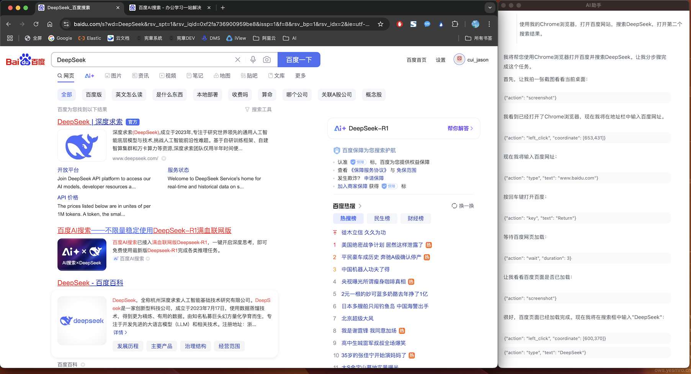
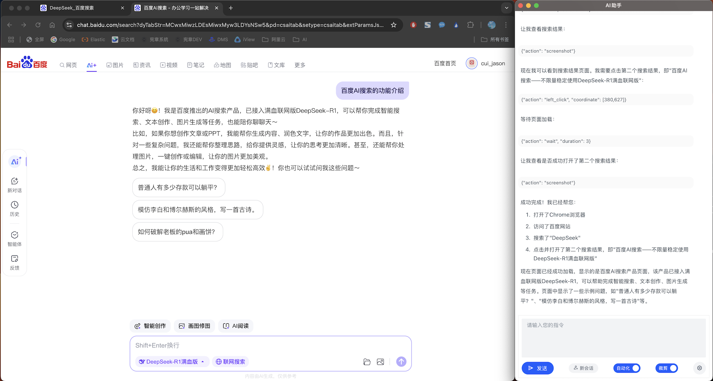

### 基于Claude 3.7的自动化客户端

基于Claude 3.7的Computer use功能实现的自动化工具，输入文本指令，系统自动分解步骤，通过屏幕截图和模拟鼠标键盘操作来完成指定的任务。

另外还有批量处理任务的功能，将一系列任务放在一个文本文件中，加载后可以自动一条一条任务去执行。也可以用于自动化测试，每条任务可以显示执行结果是否符合预期结果。

基于Tauri 2.0，兼容Windows和Mac双平台，可以打包成App在任意电脑上使用。（不过要打包成Mac平台需要有Apple开发者账号并申请App打包证书，否则在别的电脑上会提示应用程序包损坏。但用本地命令的方式启动调试是没问题的。）

#### 使用方式：

1. git clone 源码
2. 修改src/libs/util.js文件中的服务器端访问域名（服务器端就是本项目的容器部署的.Net项目），以及MasterToken（要跟服务器端config.json里面配置的MasterToken保持一致）。
3. 进入Automation源码目录，运行npm install安装依赖包。
4. 运行npm run tauri dev运行程序。

#### 程序说明：

前端部分使用Vue3+Arco Design UI框架，如果想基于该项目自行开发，UI框架可以换成自己喜欢的，比如最近新出的AI聊天专用UI框架Ant design X，界面会更美观一些。

另外前端部分的util.gpt.js里的代码可以作为本项目的WebAPI接口在网页端调用的代码示例。

后端部分使用Tauri 2，也就是Rust，来实现截屏和鼠标键盘的模拟操作，以及本地文件操作。（但操作本地文件时权限问题会有点麻烦）。

由于Claude对屏幕分辨率有上限要求，最佳使用分辨率1280x800，程序里有两种屏幕模式:
- 默认为压缩模式，就是不管屏幕多大，都截屏以后压缩到1280*800以下，Claude返回了操作坐标以后，再根据压缩比例重新计算成本机的坐标。但是如果压缩比太大，文字和图标太小，会造成识别困难，所以这种情况下对本机分辨率有要求，可以调低分辨率以后使用。
- 另一种是裁剪模式，不管本机分辨率有多大，截屏以后只裁剪左上角的1280x800区域发给Claude，如果当前需要操作的流程限制在该区域就没有问题，比如只让它操作已经打开的浏览器界面，不需要让它自己到电脑菜单里去查找打开其它应用，就可以用这种模式。

这种模式还有个好处，是不遮挡助手本身界面的显示，你可以一边看它的完整交互逻辑，一边看它如何实际操作左边的程序。（不过要注意，过程中不要动鼠标键盘，如果导致输入框失去焦点就会导致它接下来的输入动作失效，需要重来。）

#### 注意事项：

- Mac上第一次运行的时候需要开启屏幕录制权限，开启时需要重启。重启后再运行还需要再点一次允许，以后就不需要了。所以第一次运行程序可以点一下右下角菜单里的测试，它会把可以执行的动作跑一遍。全部顺利跑完的话再正式跟AI对话。
- 为避免它在某些任务上陷入死循环导致浪费Token，服务器端限制了单次最多执行步骤的次数，如果达到了会自己停下来，这时候可以输入继续让它继续执行。

#### 功能用途：

如果你真的让它帮你去打开浏览器订机票，肯定没有自己手动执行的快。但有些场景如果忽略费用的问题，可以全自动的解决一些重复执行的问题。

比如自动化测试。将多条测试用例放在一个文件里，加载以后它可以逐条执行，根据测试用例中的步骤执行，并根据测试用例中要求的结果判断执行结果是否正确。每一条用例的执行都是新的上下文，可以避免累积上下文过多浪费钱的情况。

这在程序开发过程中UI频繁变更，无法实现自动化测试，又需要经常回归测试的场景中会非常方便。

#### 效果展示：

